# Nakama Ideas Manager

---
This is a RAG project for consuming digital content and using knowledge from consumed content
---

## High level architecture



## Current list of supported types of urls:

1. https://www.instagram.com/reel/{reel_id}
2. https://www.instagram.com/p/{post_id}


## TODO:

- [ ] Transcribed audio is saved with timestamps for each word so that we later can match what was said in audio and what text was showed in video. 
      That way we will craft documents that will fully describe instagram reels.
- [ ] Use some AI model to summarize image - then we could also process speechless reels.

## Project Description (irrelevant at the moment)

This tool is designed to:
1. User can send instagram content link.
   Link is received via Telegram bot.
2. Instagram content is downloaded via knowledge_devourer. Store saved content as files in Telegram cloud. 
   Store files ids so that tool always able to retrieved uploaded content.
3. knowledge_devourer saves content using this structure:
    ```
    storage/
    ├── posts
    │   ├── DH0PM7agfDw_01.jpeg
    │   ├── DH0PM7agfDw_02.jpeg
    ├── posts_meta_data
    │   ├── DH0PM7agfDw.json
    │   ├── DHOH3GqtyEE.json
    ├── reels
    │   ├── DB-Bx-Ku8yh.mp4
    │   ├── DB2EVEQNmpp.mp4
    ├── reels_audio
    │   ├── DB-Bx-Ku8yh.flac
    │   ├── DB2EVEQNmpp.flac
    ├── reels_meta_data
    │   ├── DB-Bx-Ku8yh.json
    │   ├── DB2EVEQNmpp.json
    ├── reels_previews
    │   ├── DB-Bx-Ku8yh.jpg
    │   ├── DB2EVEQNmpp.jpg
    └── subwhisperer_output
        ├── DB-Bx-Ku8yh.mp3
        ├── DB-Bx-Ku8yh.mp3.json
        ├── DB-Bx-Ku8yh.srt
        ├── DB-Bx-Ku8yh.txt
        ├── DB-Bx-Ku8yh_merged_chunks.json
        ├── DB2EVEQNmpp.mp3
        ├── DB2EVEQNmpp.mp3.json
        ├── DB2EVEQNmpp.srt
        ├── DB2EVEQNmpp.txt
        └── DB2EVEQNmpp_merged_chunks.json
    ```

4. Process downloaded content in such way that it's easy to retrieve it using RAG or other more efficient method by saving in postgres tables.
5. User can send text prompt to Telegram bot. This prompt is used to gather context from saved content.
   Context is crafted in structured LLM friendly way and is sent back to user.